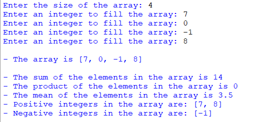

## Description
This program executes various operations on arrays of integers. It offers functions to calculate the sum, product, and mean of array elements while also categorizing positive and negative integers within the array. Users can input the array size and elements, obtaining detailed results.
## Example

